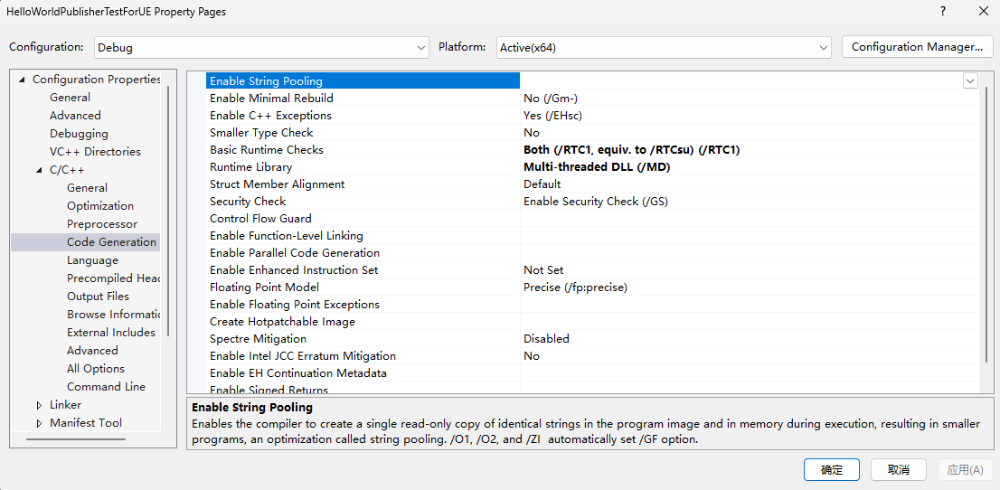
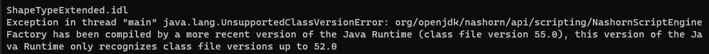
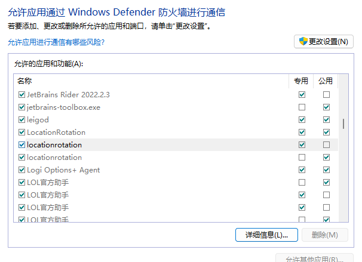

# FastDDS 学习笔记

### 添加预处理指令，避免使Warning变为Error
    #pragma warning(disable : 4668)
    #pragma warning(disable : 4530)
    #pragma warning(disable : 4582)
    #pragma warning(disable : 4265)
### 根据VS的运行Log，确定UE中需要引入哪些dll和lib

### 注意Preprocessor Definitions，忽略可能的lib依赖

### 注意jdk版本

### colon build失败的时候，可以clean之后再重新build

### 无法直接import fastdds，要先引入dll

### 注意编译python binding与使用python binding所用python版本一致

### 防火墙会导致subscriber找不到publisher
